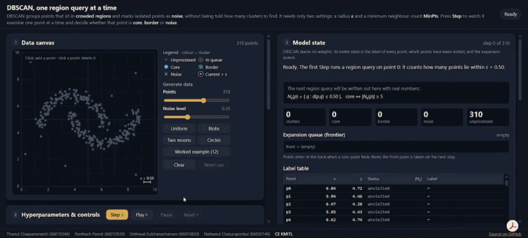

# DBSCAN Visualizer

### Interactive, Step-by-Step Density-Based Clustering

*Watch DBSCAN think: one point, one region query, one decision at a time.*

---

## About

**DBSCAN Visualizer** is an interactive teaching tool that makes the mathematics behind DBSCAN clustering **visible and intuitive**.

DBSCAN groups points that sit in crowded regions and marks isolated points as noise, without being told how many clusters to find. It needs only two settings: a radius **ε** and a minimum neighbour count **MinPts**. This page lets you step through the algorithm one region query at a time, so you can *see* why each point becomes **core**, **border** or **noise**, not just read about it.

The whole app is a single `index.html` file: no libraries, no build step, no network requests.

---

## Data Canvas

- **Click to Edit**: Add a point by clicking empty space, delete one by clicking it (keyboard: arrow keys + Enter)
- **Dataset Generators**: Uniform random, Gaussian blobs, two moons, concentric circles, and a 12-point worked example
- **Live Drawing**: See the current point, its ε-ball to scale, its neighbours, and core / border / noise marks in cluster colours

## Hyperparameters & Controls

- **ε and MinPts**: Sliders with live radius preview and a plain-English note on what each one does
- **Distance Metric**: Switch between Euclidean and Manhattan; every on-screen formula follows
- **Step / Play / Pause / Reset**: Advance exactly one region query, or auto-run until convergence

## Model State & Convergence

- **Region Query Math**: Each step written out with real numbers, e.g. `|N_ε(p₁₇)| = 4 ≥ MinPts = 4 → CORE`
- **Label Table & Queue**: Watch labels change and the expansion queue grow and shrink
- **Convergence Progress**: DBSCAN has no loss function, so the chart tracks unprocessed, assigned and noise points and clusters found
- **k-Distance Plot**: Choose ε using the elbow heuristic, with the current ε drawn as a line

---

## Quick Start

- **Online**: Open the [Live Demo](https://hhonn.github.io/CE-DA-Interactive-Algorithm-Visualizer-Web-Page/)
- **Offline**: Download [`index.html`](index.html) and double-click it; no server needed
- **Shortcuts**: `S` Step · `P` Play/Pause · `R` Reset

---

## Credits

- **Thanut Chaipanonwich** (66010346), Computer Engineering, KMITL
- **Panthach Pannil** (66010559), Computer Engineering, KMITL
- **Sitthiwat Kulchanacharoen** (66010850), Computer Engineering, KMITL
- **Nattawut Chaturaponkul** (66050146), Computer Science, KMITL
- **Development Assistant**: Claude

---

Built for CE KMITL. Open the page, press **Step**, and watch the clusters grow.
